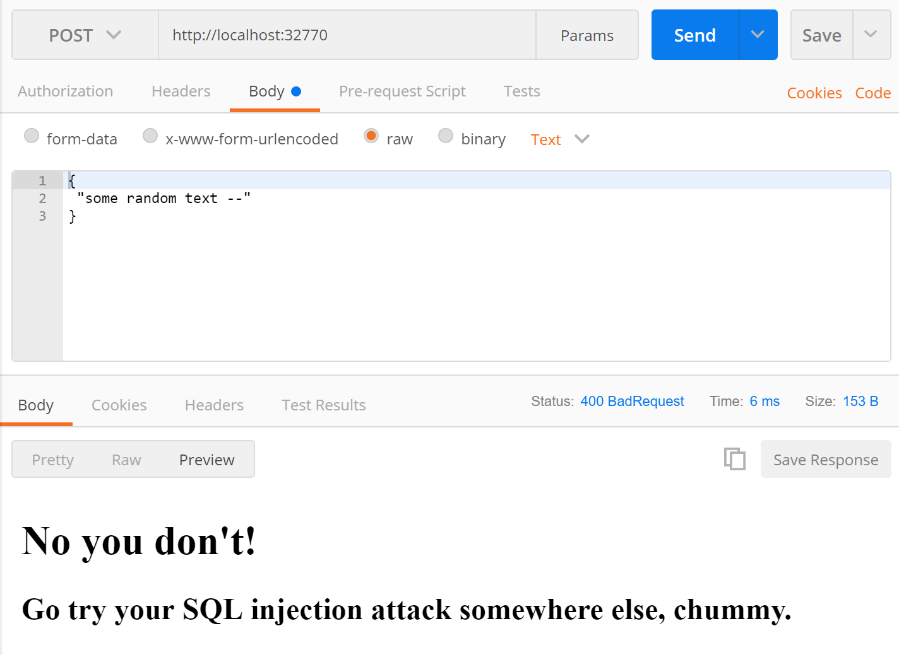

# Web Application Firewall (**WAF**)
 
Sample cross-platform Web Application Firewall, used as a security proxy for existing web apps.

The WAF sits in front of your web application container. It inspects incoming requests and blocks any that have potentially malicious payloads.

## SQL Injection

In the sample there's a basic check for a SQL injection attack. If an incoming `POST` request has a body, and the body contains the strings `--` or `/*` then they are blocked.

The response for a blocked attack is a `400` status code, with a polite message in the body:

## Usage

There are sample Docker Compose files for running a web server container, fronted by the WAF container:

 - [Docker Compose Windows sample](docker-compose-windows.yml)
 - [Docker Compose Linux sample](docker-compose-linux.yml)